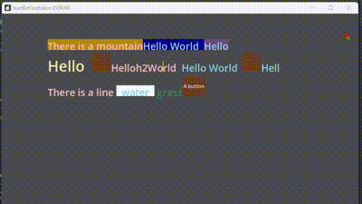
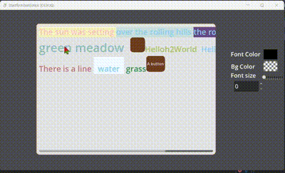
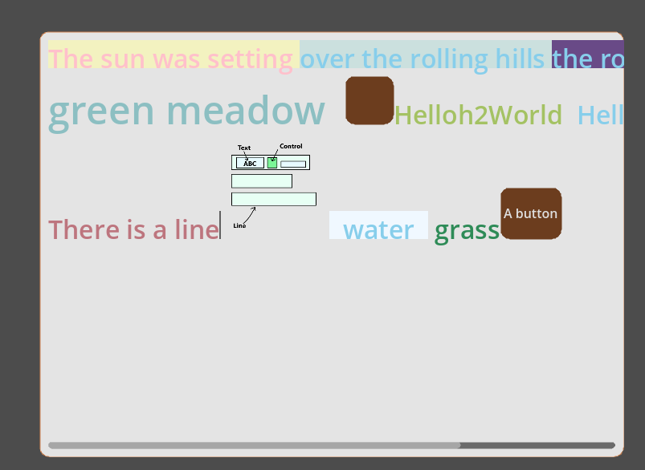
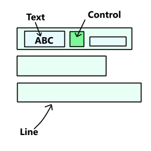

# StartRichTextEditor

Rich text editor for Godot







using  `TextLine` to draw text and `Control` to draw other(such as Image, Button, even a scene!!)

However, there are still many bugs (**not recommended for use in serious projects)**, so it’s better to learn from it, and then fix or extend it.

#### No finished:

* delete selection
* good copy&paste
* perfect caret move
* enough config
* save&load content
* undo&redo
* start text parser
* scroll(follow caret)

#### Finished:

* set&move caret
* make selection
* simple copy&paste
* ime input support
* parse text

### Usage

#### Start

* Add Node `RichTextEditor` (Dont't add other node to this node!!!) to your tree and run
* there is a example scene you can run:

  res://addons/start_rich_text_editor/example/MultiLineEditor.tscn
* Add Node `RichTextEditor`and extend the script

#### Basic

lines->line->{text,control}

control is a rect to place Control Node



#### Add init text

Use Array[Dictionary], if you want to add pure text, you can parse text to Array[Dictionary]

the dict is:

Text Block:

```c++
{
    "text":String
    "font_color":Color
    "bg_color":Color
    "font_size":int
}
```

Control Block:

```c++
{
    "key":String
    "size":Vector2
    "c":Control
}
```

A code example is in res://addons/start_rich_text_editor/example/rich_text_editor_1.gd

#### Add Control

You can use `add_control` or set 'c' in dict, and then add_child

#### Add parser

Each time when text change, a signal will be emitted to call parse

You can use Callable(line:PowerLineEdit) to set `default_parser` in MultilineEditor.

#### Application

* command line
* code edit
* chat box
* doc

---

## 中文

用于Godot4的富文本编辑器

用TextLine渲染文字和Control进行渲染控件（之后在控件里塞什么都行，图片，场景）

现在很多bugs，属于demo一类的完成度，所以最好从中学习和修改
